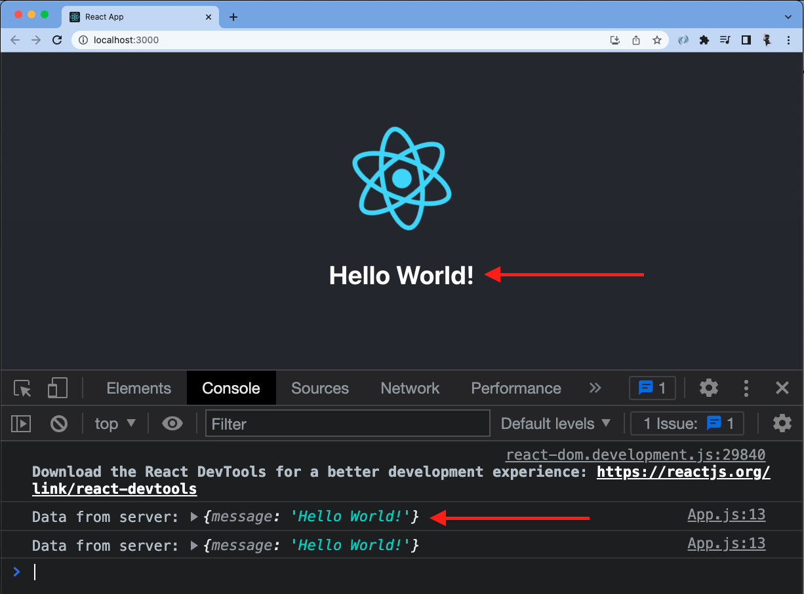

# disney-itinerary-builder

A full stack application for Disneyland visitors who want to plan their days at the theme park.

## Why I Built This

I wanted to build a more user friendly application that was easier to navigate than the offical website/ Disneyland app.

## Technologies Used

- React.js
- Bootstrap 5
- Node.js
- HTML5
- CSS3
- Azure

## Live Demo

Try the application live at [https://disney-planner.azurewebsites.net/]

## Features

- User can create an account and log in.
- User can view lists of attractions and dining options.
- User can add attractions and dining options to itinerary.
- User can view trip itinerary.
- User can update visit times for attraction/ dining options.
- User can delete items from itinerary.

## Preview


### Getting Started

1. Start PostgreSQL

```
sudo service postgresql start
```

2. Create database (replace name-of-database with a name of your choosing)

```
createdb name-of-database
```

3. In a separate terminal, run

```
npm run db:import
```

to create your tables

4. Install all dependencies with:

```
npm install
```

5. Start all the development servers with the "dev" script:

```
npm run dev
```

# final-project

A full stack JavaScript solo project.

## Getting Started

---

### Use this template to create a new repo on your GitHub account

1. Click the green `Use this template` button, select `Create a new repository`
   1. Under `Owner` select your username
   1. Give your repository a name
   1. (Optional) Add a description
   1. Leave repository as `Public`
   1. **DO NOT** Include all branches
   1. Click the green `Create repository from template` button

---

### Clone Newly created repo into `lfz-code`

1. From your newly created repo on GitHub, click the green `<> Code` button, then copy **SSH** URL
1. Open `lfz-code`, click on blue `><` button in bottom left of `lfz-code`
   1. Select `Clone Repository in Container Volume...`
   1. Paste **SSH** URL for your repo, click `Clone git repository from URL`

---

### Run and test full-stack project setup

#### Getting Started

1. Install all dependencies with `npm install`.

#### Create the database

If your final project will be using a database, create it now.

1. Start PostgreSQL
   ```sh
   sudo service postgresql start
   ```
1. Create database (replace `name-of-database` with a name of your choosing)
   ```sh
   createdb name-of-database
   ```
1. In the `server/.env` file, in the `DATABASE_URL` value, replace `changeMe` with the name of your database, from the last step
1. While you are editing `server/.env`, also change the value of `TOKEN_SECRET` to a custom value, without spaces.

If your final project will _not_ be using a database, edit `package.json` to remove the `dev:db` script.

#### Start the development servers

1. Start all the development servers with the `"dev"` script:
   ```sh
   npm run dev
   ```
1. Later, when you wish to stop the development servers, type `Ctrl-C` in the terminal where the servers are running.

#### Verify the client

1. A React app has already been created for you.
1. Take a minute to look over the code in `client/src/App.js` to get an idea of what it is doing.
1. Go to [http://localhost:3000](http://localhost:3000) in your browser. You should see the message from the server below the React logo, and in the browser console.
   
1. If you see the message from the server in your browser you are good to go, your client and server are communicating.
